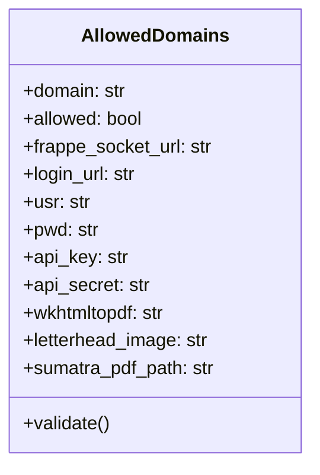
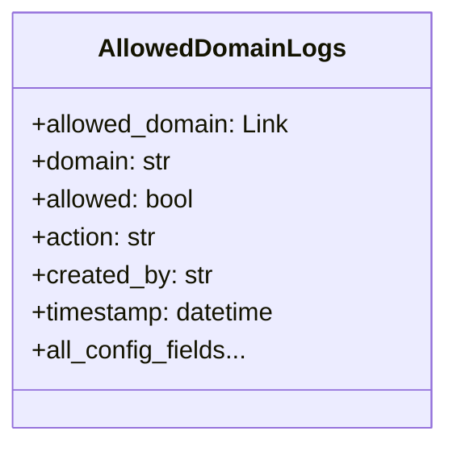

# Validate Local Printers - Domain Authorization System

[](https://frappeframework.com)
[](LICENSE)

A centralized authorization system for the Local Printers ecosystem that manages and validates domain access to the printing service.

## Key Features

### Domain Management
- ✅ **Whitelist System**: Authorize specific domains to use the printing service
- 🔄 **Auto-Creation**: Automatically registers new domains on first contact
- ⚙️ **Configuration Sync**: Maintains updated printer configuration for each domain
- 🚫 **Access Control**: Blocks unauthorized domains from using the service

### Monitoring & Logging
- 📝 **Audit Trail**: Comprehensive logging of all domain activities
- 🔍 **Change Tracking**: Records all modifications to domain configurations
- ⚠️ **Error Handling**: Detailed error logging for troubleshooting

### Security
- 🔒 **Authentication**: Validates API keys and credentials
- 🔄 **Configuration Validation**: Ensures all required settings are present
- 🛡️ **Frappe Permission System**: Leverages Frappe's built-in security model

## Installation

### 1. Install the app to your Frappe bench:
```bash
bench get-app validate_local_printers https://github.com/Ahmed-Mansy-Mansico/validate_local_printers
bench --site [your-site] install-app validate_local_printers
bench migrate
```

### 2. Set up required doctypes:
The app will automatically create:
- `Allowed Domains` (main configuration)
- `Allowed Domain Logs` (audit trail)

## API Endpoints

### `validate_domain`
- **Path**: `/api/method/validate_local_printers.validate_users.validate_domain`
- **Method**: POST
- **Parameters**: 
  ```json
  {
    "config_data": {
      "FRAPPE_SOCKET_URL": "https://client-domain.com",
      "LOGIN_URL": "https://client-domain.com/api/method/login",
      "API_KEY": "client_api_key",
      "API_SECRET": "client_api_secret",
      "AUTH_DATA": {
        "usr": "client_username",
        "pwd": "client_password"
      },
      "WKHTMLTOPDF": "/path/to/wkhtmltopdf",
      "LETTERHEAD_IMAGE": "https://path/to/letterhead.png",
      "SUMATRA_PDF_PATH": "C:/path/to/SumatraPDF.exe"
    }
  }
  ```
- **Responses**:
  - Valid domain: `{"status": "valid", "message": "..."}`
  - Invalid domain: `{"status": "invalid", "message": "..."}`
  - Error: `{"status": "error", "message": "..."}`

## Doctype Structure

### Allowed Domains


### Allowed Domain Logs


## Workflow

1. **Initial Contact**:
   - Windows middleware sends domain configuration
   - System checks if domain exists
   - If new, creates domain record with default allowed=True

2. **Validation Check**:
   - Verifies domain exists in Allowed Domains
   - Checks 'allowed' status
   - Updates configuration if changed

3. **Logging**:
   - Creates audit log entry for every action
   - Tracks user who made changes
   - Records timestamp of activity

## Usage Examples

### Python Implementation
```python
import requests

response = requests.post(
    "https://validator-site.com/api/method/validate_local_printers.validate_users.validate_domain",
    json={
        "config_data": {
            "FRAPPE_SOCKET_URL": "https://client.com",
            # ... other config fields
        }
    }
)

if response.json().get("status") == "valid":
    print("Domain authorized!")
else:
    print("Access denied:", response.json().get("message"))
```

### Frappe Client Implementation
```javascript
frappe.call({
    method: "validate_local_printers.validate_users.validate_domain",
    args: {
        config_data: {
            FRAPPE_SOCKET_URL: "https://client.com",
            // ... other config fields
        }
    },
    callback: function(response) {
        if(response.message.status === "valid") {
            console.log("Authorized!");
        }
    }
});
```

## Related Projects

- [local_printers_winapp](https://github.com/Ahmed-Mansy-Mansico/local_printers_winapp): Windows middleware
- [local_printers](https://github.com/Ahmed-Mansy-Mansico/local_printers): Frappe client app

## License

MIT License - See [LICENSE](LICENSE) for details.
```

This README provides:

1. Clear overview of the authorization system
2. Detailed installation instructions
3. Comprehensive API documentation
4. Visual doctype structure diagrams
5. Complete workflow explanation
6. Usage examples in both Python and JavaScript
7. Related project links
8. Error handling and response documentation

The document is structured to help both administrators implementing the system and developers integrating with it.
